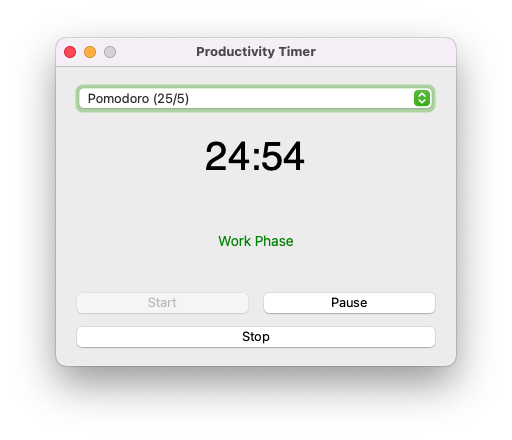

# Focus Timer 🕒

[](https://www.python.org/)
[](https://www.riverbankcomputing.com/software/pyqt/)
[](LICENSE)

A productivity timer application implementing popular time management techniques with a clean macOS-native interface.



## Features ✨
- **Multiple Timer Methods**  
  🎯 52/17 · 🍅 Pomodoro (25/5) · ⏳ Ultradian (90/20)
- System Notifications 🔔


## Installation 💻

### For End Users
1. Download latest release:  
   [ProductivityTimer_v1.0.dmg](https://github.com/yourusername/productivity-timer/releases/latest)
   
2. Open DMG and install:
   ```bash
   # Allow unsigned apps if needed
   sudo spctl --master-disable
3. Drag to Applications folder

## Uninstallation 💻
   ```bash
   # Run uninstall script from DMG
   ./Uninstall.command
  ```

## Building from Source 🛠️
### Prerequisites 📋

### For End Users
- **macOS 11 Big Sur** or later  
- **Disk Space**: Minimum 50MB free space  

### For Developers
- **Python 3.9+**  
  ```bash
  # Verify installation
  python3 --version

  pip install pyqt6
  pip install pyinstaller

  # DMG creation tool
  brew install create-dmg

  # Image manipulation (for icons/backgrounds)
  brew install imagemagick

### Build Steps
  ```bash
  # Clone repository
  git clone https://github.com/yourusername/productivity-timer.git
  cd productivity-timer
  
  # Create virtual environment
  python -m venv .venv
  source .venv/bin/activate
  
  # Install dependencies
  pip install -r requirements.txt
  
  # Build application
  pyinstaller --windowed --name ProductivityTimer \
  --icon assets/icons/app_icon.icns \
  --osx-bundle-identifier "com.yourcompany.productivitytimer" \
  src/main.py
  
  # Create installer DMG
  create-dmg ProductivityTimer.dmg dist/
  ```
## Tech Stack 🔧
- Core Language: Python 3
- GUI Framework: PyQt6
- Packaging: PyInstaller
- Installer: create-dmg
- CI/CD: GitHub Actions (recommended)

## License 📄

  

